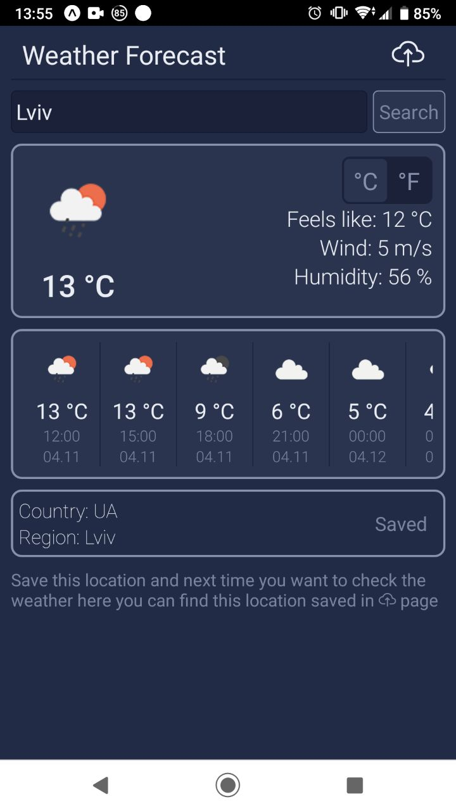

# Weather-App

```
git clone https://github.com/Oscare101/Weather-App.git
cd Weather-App/
npm i
npx expo start
```

used free api from https://openweathermap.org/ (up to 60 requests per minute)

## UI



